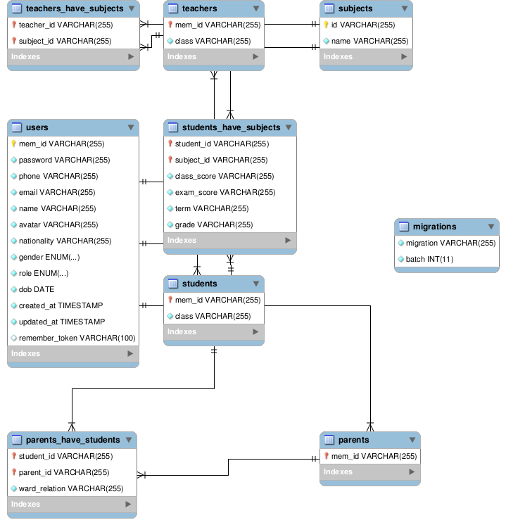

# SMS (School Management System)
SMS is a laravel based web application for school owners.
This app is filled with common tools for the administrator, students, guardians, teachers and the accountant, unifying the educational process.

## Administrator
The administrator can perform the following tasks:

* Enroll a new student.
* Enroll a teacher.
* Send Notices
* View Student Statistics.

## Accountant

## Student
The student can perform the following tasks:

* Pay Fees.
* View their daily teaching schedule.
* View the Academic caledar.
* Render graphical models of their academic progress.
* View their academic progress.
* Report incidents.

## Teacher
The teacher can perform the following tasks:

* Add student test results.
* View their lessons schedule
* View the Academic caledar.
* Send notifications via sms or email to target groups.
* Report incidents.
* Render graphical models of their student's academic progress.

## Guardian
A guardian can perform the following tasks:

* Pay their ward's Fees.
* View their ward's daily lessons schedule.
* View the Academic caledar.
* Render graphical models of their ward's academic progress.
* View their ward's academic progress.

# Database
This section decribes the datamap for this system to guide developers when writing queries.

## Entity Relation Diagram

